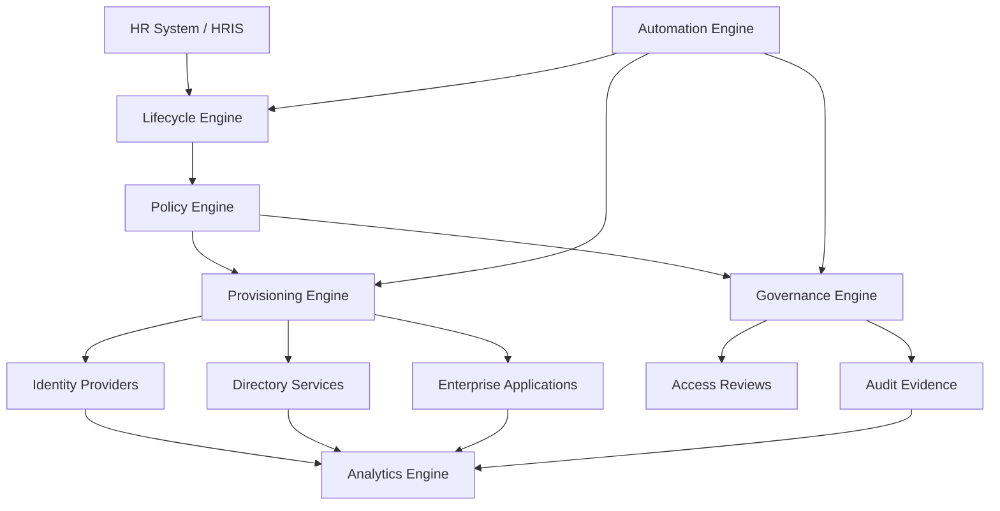

# IdentityOS

> **An Enterprise Identity Operating System for Zero Trust organizations.**

IdentityOS is a reference architecture and design philosophy for modern Identity & Access Management (IAM). It reimagines identity as an operating system that continuously orchestrates onboarding, role changes, governance, privileged access, automation, and offboarding through policy-driven security.

This project is designed to demonstrate how enterprise identity can operate as a scalable business capability—not just as a collection of tickets, scripts, and disconnected administrative tasks.

---

## Vision

Create an identity ecosystem where every person has the right access, at the right time, for the right reasons—securely, automatically, and with complete auditability.

Identity should not be an obstacle to productivity. It should be the invisible foundation that enables trust, security, compliance, and operational excellence across the enterprise.

---

## Mission

IdentityOS exists to transform Identity & Access Management from a reactive support function into a proactive enterprise operating model.

The mission of IdentityOS is to:

* Automate the complete identity lifecycle.
* Enforce Zero Trust and least privilege by design.
* Align access decisions with business roles and attributes.
* Reduce privilege creep and access drift.
* Improve onboarding, mover, and offboarding experiences.
* Provide continuous governance and audit visibility.
* Help organizations scale identity securely across departments, regions, and business units.

---

## What IdentityOS Is

IdentityOS is a vendor-agnostic reference architecture for enterprise identity orchestration.

It is designed to coordinate identity activity across systems such as:

* HR platforms
* Identity providers
* Directory services
* Cloud platforms
* SaaS applications
* Privileged access systems
* Ticketing systems
* Security monitoring tools
* Audit and compliance workflows

IdentityOS is not intended to replace identity providers like Microsoft Entra ID, Active Directory, Okta, or Google Workspace. Instead, it acts as an orchestration and governance layer that helps those systems work together more intelligently.

---

## Core Concept

> **Identity is not just authentication. Identity is the operating system of trust.**

Every employee, contractor, administrator, application, service account, and vendor identity creates risk if it is not governed properly.

IdentityOS approaches identity as an enterprise-wide system that must be:

* Policy-driven
* Automated
* Auditable
* Scalable
* Secure by default
* Aligned with business intent

---

## Quick Links

| Resource                                | Purpose                                                                                                                       |
| --------------------------------------- | ----------------------------------------------------------------------------------------------------------------------------- |
| [Project Summary](PROJECT_SUMMARY.md)   | A recruiter and interviewer-friendly overview of what IdentityOS is, what problem it solves, and what skills it demonstrates. |
| [Documentation](docs/README.md)         | Core architecture and design documentation.                                                                                   |
| [Diagrams](diagrams/README.md)          | Visual architecture and workflow diagrams.                                                                                    |
| [Reference Models](reference/README.md) | Role catalog and access review reference models.                                                                              |
| [Examples](examples/README.md)          | Sample identity events and policy decision datasets.                                                                          |
| [Automation](automation/README.md)      | Prototype automation scripts and execution guidance.                                                                          |
| [Changelog](CHANGELOG.md)               | Version history and project milestones.                                                                                       |
| [Reports](reports/README.md) | Generated governance reports that turn IdentityOS sample data into audit and risk visibility. |


## Project Navigation

IdentityOS is organized into architecture documents, reference models, sample data, and prototype automation.

### Reports

| Report                                                          | Purpose                                                                                                           |
| --------------------------------------------------------------- | ----------------------------------------------------------------------------------------------------------------- |
| [Reports Index](reports/README.md)                              | Provides an overview of generated IdentityOS reports.                                                             |
| [Sample Governance Report](reports/sample-governance-report.md) | Summarizes sample policy decisions, governance requirements, risk levels, remediation actions, and audit reasons. |
| [Sample Risk Score Report](reports/sample-risk-score-report.md) | Summarizes calculated identity risk scores, risk levels, risk factors, and recommended governance actions. |
| [Sample Access Drift Report](reports/sample-access-drift-report.md) | Summarizes detected access drift, drift severity, excess access, and recommended remediation actions. |
| [Sample Dashboard Summary](reports/sample-dashboard-summary.md) | Summarizes sample dashboard metrics for executive identity risk, lifecycle operations, governance, risk scoring, access drift, and automation health. |


### Architecture Documents

| Document                                         | Purpose                                                                                             |
| ------------------------------------------------ | --------------------------------------------------------------------------------------------------- |
| [Vision](docs/vision.md)                         | Explains why IdentityOS exists and what future state it is designed to support.                     |
| [Mission](docs/mission.md)                       | Defines the practical mission and operating objectives of IdentityOS.                               |
| [Guiding Principles](docs/guiding-principles.md) | Establishes the architectural principles that guide IdentityOS design decisions.                    |
| [Architecture](docs/architecture.md)             | Describes the high-level IdentityOS architecture and core engines.                                  |
| [Lifecycle Engine](docs/lifecycle-engine.md)     | Defines how Joiner, Mover, Leaver, contractor, vendor, and non-human identity events are handled.   |
| [Policy Engine](docs/policy-engine.md)           | Explains how IdentityOS evaluates identity attributes and produces access decisions.                |
| [Governance](docs/governance.md)                 | Defines the governance model for access reviews, exceptions, privileged access, and audit evidence. |
| [Roadmap](docs/roadmap.md)                       | Outlines the phased development plan for IdentityOS.                                                |
| [Dashboard Concepts](docs/dashboard-concepts.md) | Defines executive, IAM operations, governance, risk, access drift, privileged access, contractor/vendor, non-human identity, and automation dashboard concepts. |

### Visual Diagrams

| Diagram                                                                   | Purpose                                                                                                  |
| ------------------------------------------------------------------------- | -------------------------------------------------------------------------------------------------------- |
| [Diagrams Index](diagrams/README.md)                                      | Provides a central index for all IdentityOS visual architecture diagrams.                                |
| [High-Level Architecture](diagrams/identityos-high-level-architecture.md) | Shows the overall IdentityOS system context, core engines, and identity event pipeline.                  |
| [Joiner Workflow](diagrams/joiner-workflow.md)                            | Shows how IdentityOS handles onboarding, provisioning, security controls, and audit evidence.            |
| [Mover Workflow](diagrams/mover-workflow.md)                              | Shows how IdentityOS handles role changes, access realignment, and privilege creep reduction.            |
| [Leaver Workflow](diagrams/leaver-workflow.md)                            | Shows how IdentityOS handles offboarding, deprovisioning, privileged access removal, and audit evidence. |
| [Policy Engine Decision Flow](diagrams/policy-engine-decision-flow.md)    | Shows how IdentityOS evaluates identity events and produces access decisions.                            |
| [Governance Workflow](diagrams/governance-workflow.md)                    | Shows how IdentityOS handles approvals, reviews, exceptions, remediation, and audit evidence.            |
| [Access Review Cycle](diagrams/access-review-cycle.md)                    | Shows how access reviews are scoped, routed, decided, remediated, evidenced, and improved over time.     |


### Reference Models

| Reference                                               | Purpose                                                                              |
| ------------------------------------------------------- | ------------------------------------------------------------------------------------ |
| [Role Catalog](reference/role-catalog.md)               | Defines sample business roles and role-based access packages.                        |
| [Access Review Model](reference/access-review-model.md) | Defines how access should be reviewed, certified, remediated, and audited over time. |
| [Risk Scoring Model](reference/risk-scoring-model.md) | Defines how IdentityOS calculates identity risk using access sensitivity, lifecycle state, governance status, privilege, ownership, exceptions, and access drift. |
| [Access Drift Model](reference/access-drift-model.md) | Defines how IdentityOS detects access that no longer aligns with expected role, department, lifecycle state, ownership, or governance requirements. |

### Sample Data

| File                                                             | Purpose                                                                                              |
| ---------------------------------------------------------------- | ---------------------------------------------------------------------------------------------------- |
| [Sample Identity Events](examples/sample-identity-events.json)   | Provides sample Joiner, Mover, Leaver, contractor, privileged access, and non-human identity events. |
| [Sample Policy Decisions](examples/sample-policy-decisions.json) | Shows how IdentityOS evaluates identity events and produces policy decisions.                        |
| [Sample Dashboard Metrics](examples/sample-dashboard-metrics.json) | Provides sample dashboard metrics for executive identity risk, lifecycle operations, governance, risk scoring, access drift, and automation health. |

### Prototype Automation

| Script                                             | Purpose                                                                                     |
| -------------------------------------------------- | ------------------------------------------------------------------------------------------- |
| [Policy Evaluator](automation/policy-evaluator.py) | Reads sample identity events and policy decisions, then prints a policy evaluation summary. |
| [Risk Scorer](automation/risk-scorer.py) | Calculates sample identity risk scores from identity events and policy decisions, then generates a Markdown risk score report. |
| [Access Drift Detector](automation/access-drift-detector.py) | Detects sample access drift from identity events and policy decisions, then generates a Markdown access drift report. |
| [Dashboard Summary Generator](automation/generate-dashboard-summary.py) | Reads sample dashboard metrics and generates a Markdown dashboard summary report. |

### Run the Prototype

From the project root, run:

```powershell
python automation/policy-evaluator.py
```

Or, if using the Windows Python launcher:

```powershell
py automation/policy-evaluator.py
```


## Core Engines

IdentityOS is organized around six core engines.

| Engine                  | Purpose                                                                      |
| ----------------------- | ---------------------------------------------------------------------------- |
| **Lifecycle Engine**    | Orchestrates Joiner, Mover, and Leaver identity events.                      |
| **Policy Engine**       | Evaluates business rules, role packages, attributes, and access decisions.   |
| **Provisioning Engine** | Creates, updates, disables, and removes access across connected systems.     |
| **Governance Engine**   | Manages access reviews, certifications, exceptions, and compliance evidence. |
| **Automation Engine**   | Executes workflows, notifications, approvals, and integrations.              |
| **Analytics Engine**    | Provides dashboards, metrics, audit trails, and identity risk visibility.    |

---

## High-Level Architecture



---

## Example Enterprise Scenario

IdentityOS is modeled around a fictional enterprise environment called **Atlas Legal Group**, a global professional services organization.

### Environment Assumptions

* 10,000+ employees
* Multiple offices and regions
* Hybrid identity environment
* Microsoft Entra ID and Active Directory
* Microsoft 365
* HR-driven onboarding and offboarding
* Role-based and attribute-based access control
* Privileged access requirements
* Compliance and audit obligations
* Contractors, vendors, executives, and high-risk roles

This fictional environment allows the architecture to model real enterprise identity challenges without referencing any proprietary employer systems.

---

## Identity Lifecycle Model

IdentityOS focuses on three major identity lifecycle events:

### Joiner

A new employee joins the organization.

IdentityOS should:

* Receive the HR event.
* Create the identity.
* Assign baseline access.
* Apply role-based access packages.
* Enforce MFA and Conditional Access.
* Provision required applications.
* Notify the manager.
* Log all actions for auditability.

### Mover

An employee changes role, department, location, or responsibility.

IdentityOS should:

* Detect the attribute change.
* Compare current access against the new role.
* Remove stale or unnecessary access.
* Assign new required access.
* Route exceptions for approval.
* Update governance records.
* Preserve an audit trail.

### Leaver

An employee, contractor, or vendor exits the organization.

IdentityOS should:

* Disable the identity.
* Revoke active sessions.
* Remove group memberships.
* Remove privileged roles.
* Deprovision application access.
* Preserve required records.
* Generate offboarding evidence.

---

## Design Principles

IdentityOS is guided by the following principles:

1. **Identity is the security perimeter.**
2. **Least privilege is the default.**
3. **Access should be based on business roles and attributes.**
4. **Automation should reduce repetitive manual work.**
5. **Every access decision should be explainable.**
6. **Every identity event should be auditable.**
7. **Governance should be continuous, not annual.**
8. **Security should improve productivity, not block it.**
9. **Privileged access should be temporary, approved, and monitored.**
10. **The architecture should scale without redesign.**

---

## Repository Structure

```text
identity-os/
├── README.md
├── LICENSE
├── docs/
│   ├── vision.md
│   ├── mission.md
│   ├── guiding-principles.md
│   ├── architecture.md
│   ├── lifecycle-engine.md
│   ├── policy-engine.md
│   ├── governance.md
│   └── roadmap.md
├── diagrams/
├── automation/
├── examples/
└── reference/
```

---

## Planned Capabilities

Future IdentityOS documentation and prototypes will cover:

* Joiner / Mover / Leaver lifecycle orchestration
* Role catalog design
* Access package modeling
* Attribute-based access control
* Conditional Access strategy
* Privileged Identity Management
* Access review workflows
* Non-human identity governance
* Contractor and vendor lifecycle controls
* Microsoft Graph automation examples
* PowerShell automation examples
* Executive identity risk dashboards
* Audit and compliance reporting models

---

## Roadmap

### Phase 1: Architecture Foundation

* Define the vision and mission.
* Document core principles.
* Build the high-level architecture.
* Establish lifecycle engine concepts.

### Phase 2: Lifecycle Orchestration

* Design Joiner workflows.
* Design Mover workflows.
* Design Leaver workflows.
* Define lifecycle audit requirements.

### Phase 3: Policy and Governance

* Build role catalog examples.
* Define policy evaluation models.
* Design access review workflows.
* Model privileged access governance.

### Phase 4: Automation Examples

* Add PowerShell examples.
* Add Microsoft Graph examples.
* Add sample JSON/YAML policy files.
* Demonstrate identity lifecycle automation patterns.

### Phase 5: Prototype

* Build a lightweight IdentityOS interface or dashboard.
* Demonstrate lifecycle simulation.
* Display identity risk and governance metrics.

---

## Project Status

**Current Status:** Early-stage reference architecture.

IdentityOS is currently in the architecture and documentation phase. The goal is to build a professional, portfolio-ready identity architecture project that demonstrates enterprise IAM design, Zero Trust thinking, automation strategy, and governance maturity.

---

## Author

**Renard Priester**
Identity & Access Management | Zero Trust | Cloud Security | Enterprise Identity Architecture

GitHub: [@renardpriester](https://github.com/renardpriester)

---

## Guiding Statement

> **I do not just build access. I build trust at enterprise scale.**
