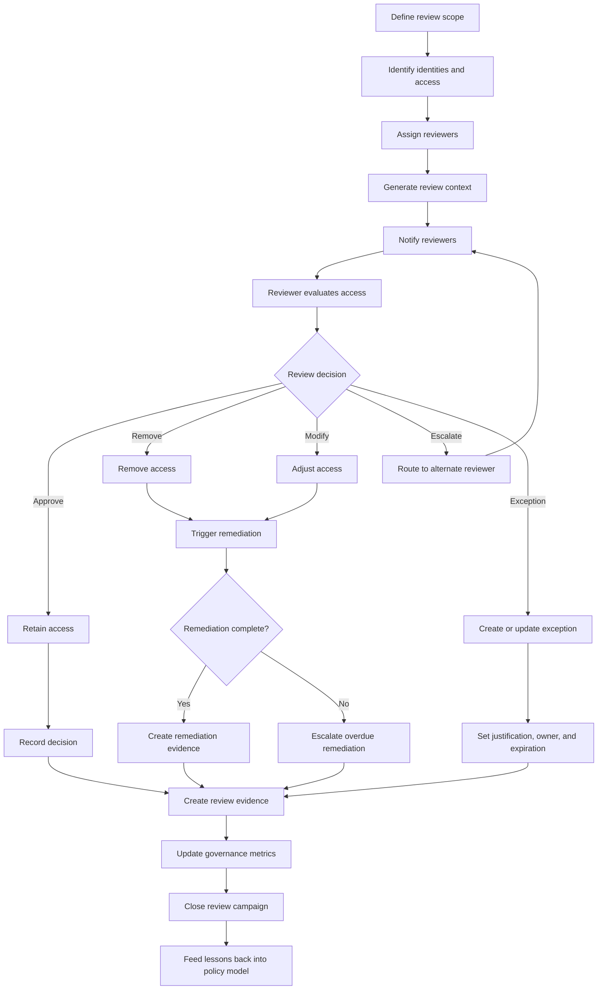

# IdentityOS Access Review Cycle

## Purpose

This diagram shows how IdentityOS manages the access review lifecycle.

Access reviews confirm whether users, contractors, vendors, privileged identities, and non-human identities should continue to have access over time.

The goal of the Access Review Cycle is to make sure access remains aligned with business need, least privilege, risk level, ownership, and audit requirements.

---

## Access Review Cycle Diagram



---

## Access Review Lifecycle

IdentityOS access reviews follow a repeatable cycle.

```text
Scope
  ↓
Review
  ↓
Decision
  ↓
Remediation
  ↓
Evidence
  ↓
Metrics
  ↓
Policy Improvement
```

Access reviews should not end with reviewer clicks. They should result in confirmed access, removed access, adjusted access, documented exceptions, and improved policy.

---

## Review Scope

The first step is defining what should be reviewed.

Review scope may include:

* All users in a department
* All users with access to an application
* All users with privileged access
* All contractors
* All vendors
* All exceptions
* All non-human identities
* All high-risk access
* All access granted during a specific time period

The scope should match the risk and business purpose of the review.

---

## Reviewer Assignment

IdentityOS should assign reviews to the correct decision owners.

| Access Type               | Recommended Reviewer                         |
| ------------------------- | -------------------------------------------- |
| Department access         | Manager                                      |
| Application access        | Application owner                            |
| Privileged access         | Security owner or privileged access owner    |
| Contractor access         | Sponsor                                      |
| Vendor access             | Business owner                               |
| Exception access          | Exception owner and risk owner               |
| Non-human identity access | Technical owner and application owner        |
| High-risk access          | Manager plus security or compliance reviewer |

The right reviewer is the person who understands whether access is still justified.

---

## Review Context

Reviewers need context to make meaningful decisions.

IdentityOS should provide:

* Identity name
* Department
* Job title
* Manager
* Worker type
* Application
* Permission level
* Role package
* Access owner
* Risk level
* Date granted
* Last reviewed date
* Last activity date if available
* Expiration date if applicable
* Exception status if applicable
* Business justification if available

Access reviews should be understandable to business reviewers, not only technical administrators.

---

## Review Decisions

Reviewers should have clear decision options.

| Decision  | Meaning                                             |
| --------- | --------------------------------------------------- |
| Approve   | Access is still required.                           |
| Remove    | Access is no longer required.                       |
| Modify    | Access should be reduced or changed.                |
| Escalate  | Another reviewer should decide.                     |
| Exception | Access is outside policy but temporarily justified. |

Each decision should be recorded with reviewer, timestamp, and justification when required.

---

## Remediation

When a reviewer removes or modifies access, IdentityOS should trigger remediation.

Remediation may include:

* Removing group membership
* Removing application access
* Reducing permission level
* Disabling temporary access
* Removing privileged eligibility
* Updating role package membership
* Transferring ownership
* Expiring an exception

The review is not complete until remediation is completed or formally tracked.

---

## Exception Handling

If access is outside the standard policy model but still required, it should become an exception.

Every exception should include:

* Business justification
* Access owner
* Risk owner
* Expiration date
* Review date
* Approval record
* Risk level
* Remediation plan

Exceptions should be temporary, visible, and reviewed frequently.

---

## Evidence Creation

Every access review should generate audit evidence.

Evidence should include:

* Review campaign name
* Review scope
* Reviewer
* Identity reviewed
* Access reviewed
* Decision
* Justification
* Timestamp
* Remediation action
* Remediation status
* Exception status
* Policy reference

Audit evidence proves that access was reviewed and action was taken.

---

## Metrics

IdentityOS should track access review metrics such as:

* Reviews completed
* Reviews overdue
* Access approved
* Access removed
* Access modified
* Access escalated
* Exceptions created
* Exceptions expired
* Remediation completed
* Remediation overdue
* High-risk access retained
* Privileged access removed
* Average completion time

Metrics turn governance into operational visibility.

---

## Policy Feedback Loop

Access review results should improve the identity policy model.

Examples:

* If many users lose the same access during review, the role package may be too broad.
* If managers frequently approve exceptions, the role model may be missing a valid access pattern.
* If remediation is often delayed, automation needs improvement.
* If privileged access is repeatedly retained without justification, governance needs stronger controls.

Access reviews should make the system smarter over time.

---

## Success Criteria

The Access Review Cycle is successful when:

* Review scope is clear.
* Reviewers receive useful context.
* Reviewers make meaningful decisions.
* Removed access is actually remediated.
* Exceptions are justified and time-bound.
* Evidence is created automatically.
* Metrics show progress.
* Policy improves based on review outcomes.
* Access remains aligned with business need.

---

## Summary

The Access Review Cycle ensures that access remains appropriate after it is granted.

IdentityOS uses access reviews to continuously verify trust, reduce stale access, remove privilege creep, and strengthen audit readiness.

> Access should not only be approved once. Access should be continuously justified.
