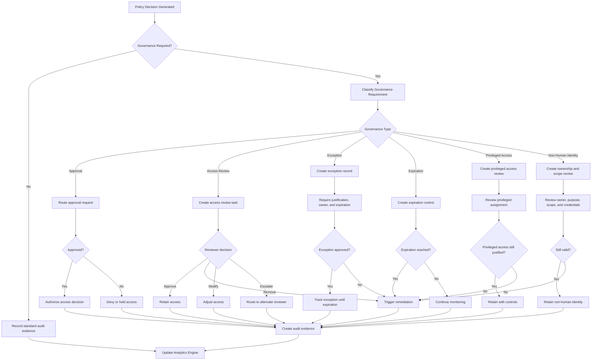
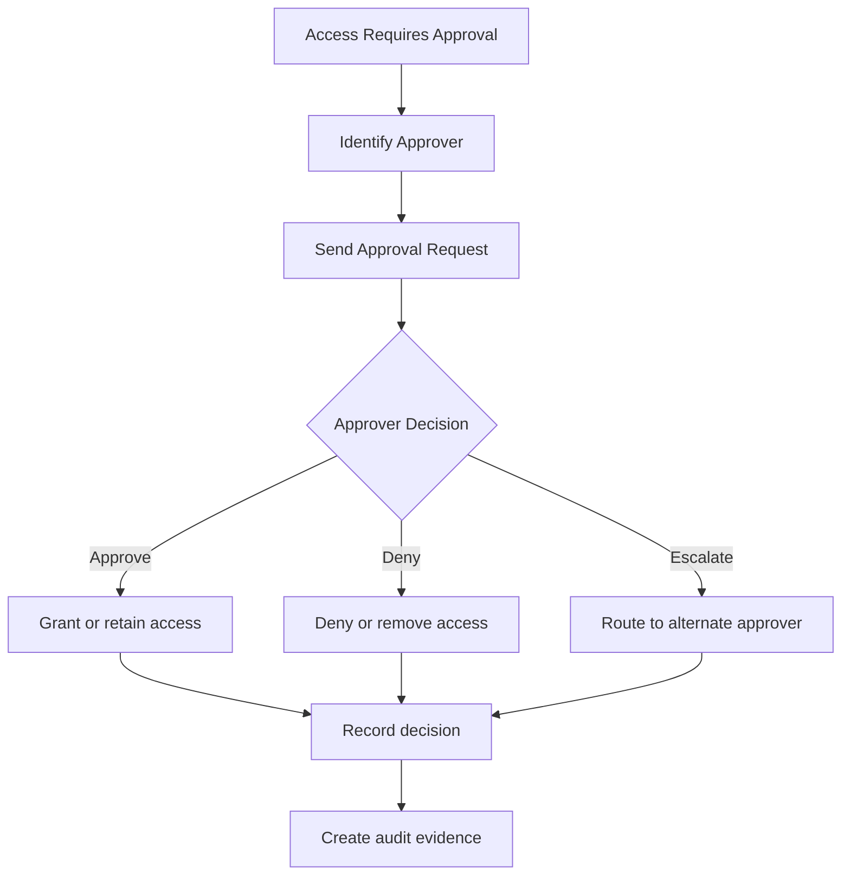
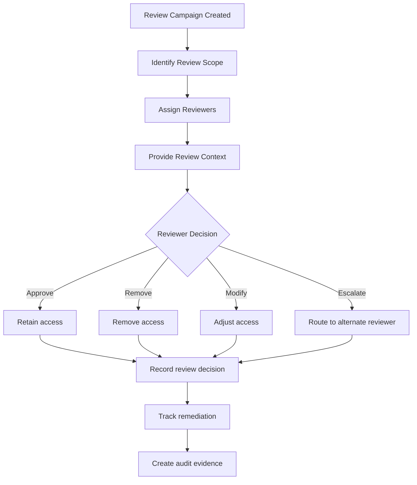
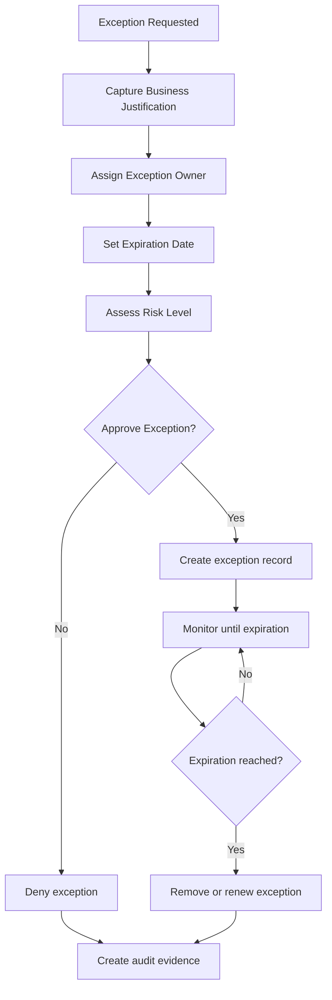
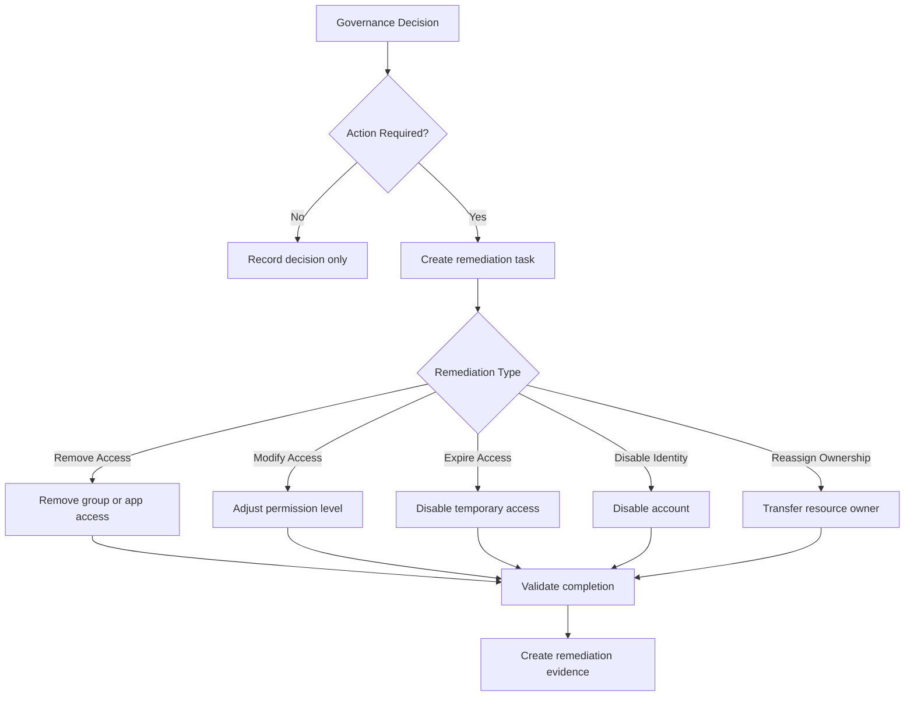

# IdentityOS Governance Workflow

## Purpose

This diagram shows how IdentityOS manages identity governance.

Governance ensures that access is not only granted correctly, but continuously validated, reviewed, remediated, and supported by audit evidence.

The Governance Workflow connects policy decisions to approvals, access reviews, exception handling, remediation, and compliance reporting.

---

## Governance Workflow Diagram

---

## Governance Triggers

IdentityOS governance can be triggered by multiple events.

| Trigger                   | Example                                                  |
| ------------------------- | -------------------------------------------------------- |
| Policy Decision           | Access requires approval before assignment.              |
| Joiner Event              | New user receives sensitive access.                      |
| Mover Event               | User changes department and access must be reviewed.     |
| Leaver Event              | Offboarding requires privileged access removal evidence. |
| Contractor Expiration     | Contractor access must be renewed or removed.            |
| Privileged Access Request | Elevated access requires justification and approval.     |
| Access Review Campaign    | Manager or application owner must certify access.        |
| Exception Request         | User needs access outside the standard role model.       |
| Non-Human Identity Review | Service account ownership and scope must be validated.   |

---

## Governance Types

IdentityOS supports several governance types.

| Governance Type           | Purpose                                                |
| ------------------------- | ------------------------------------------------------ |
| Approval                  | Confirms access before it is granted.                  |
| Access Review             | Confirms whether existing access should continue.      |
| Exception Management      | Tracks access outside the standard policy model.       |
| Expiration Control        | Ensures temporary access does not become permanent.    |
| Privileged Access Review  | Validates elevated or administrative access.           |
| Non-Human Identity Review | Validates service accounts and automation identities.  |
| Remediation               | Removes or adjusts access after a governance decision. |
| Audit Evidence            | Records proof of governance activity.                  |

---

## Approval Workflow

Approvals are required when access is sensitive, privileged, temporary, or outside the standard role package.

---

## Access Review Workflow

Access reviews confirm whether access remains appropriate over time.

---

## Exception Workflow

Exceptions should be visible, justified, approved, time-bound, and reviewed.

---

## Remediation Workflow

Governance decisions should lead to action.

---

## Governance Evidence

Every governance action should create evidence.

Evidence should include:

* Governance action type
* Identity reviewed
* Access reviewed
* Reviewer or approver
* Decision
* Justification
* Risk level
* Timestamp
* Remediation action
* Remediation status
* Exception status
* Expiration date if applicable
* Related policy decision
* Related lifecycle event

Evidence makes governance explainable and audit-ready.

---

## Governance Metrics

IdentityOS should track governance metrics such as:

* Access reviews completed
* Access reviews overdue
* Access removed through reviews
* Privileged access reviewed
* Privileged access removed
* Exceptions approved
* Exceptions expired
* Contractor renewals approved
* Contractor access removed
* Non-human identities reviewed
* Remediation tasks completed
* Average review completion time
* Governance actions by risk level

Metrics help identity leaders understand whether governance is reducing risk.

---

## Governance Success Criteria

The Governance Workflow is successful when:

* Access approvals are routed to the correct owners.
* Access reviews are completed on time.
* Exceptions are justified, approved, and time-bound.
* Temporary access expires automatically.
* Privileged access is reviewed frequently.
* Non-human identities have owners and business purpose.
* Remediation actions are completed.
* Audit evidence is generated.
* Governance reduces stale access and privilege creep.

---

## Summary

The Governance Workflow ensures that access decisions remain accountable over time.

IdentityOS governance is not just about proving compliance. It is about continuously verifying whether trust is still justified.

> Identity governance is how IdentityOS turns access decisions into accountable trust.
