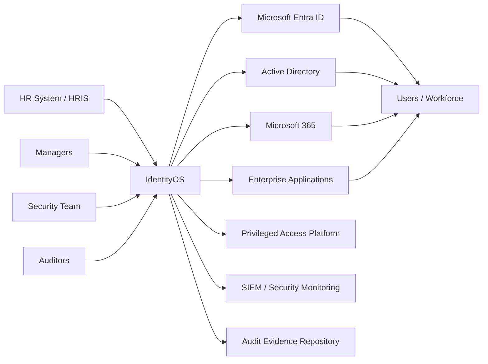
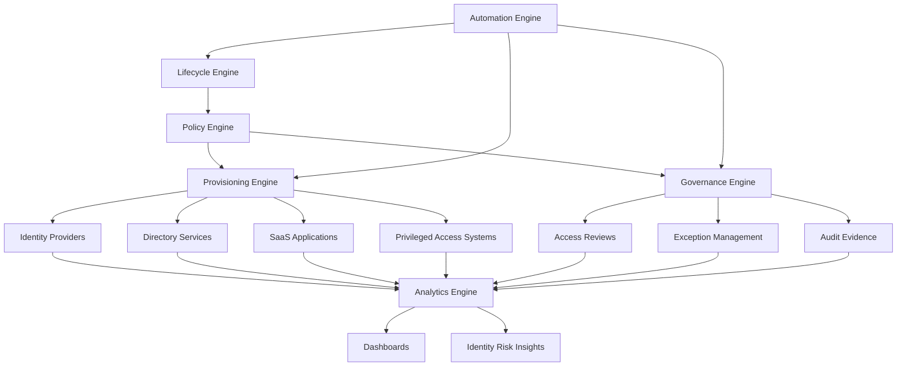
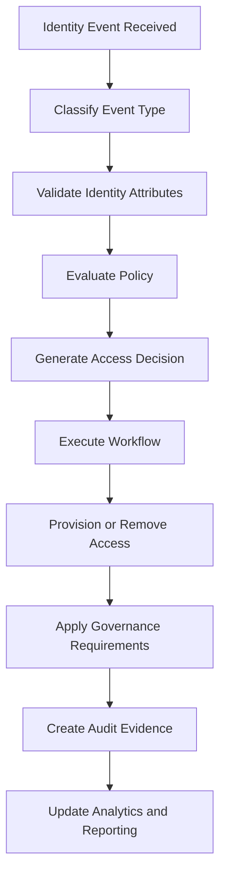

# IdentityOS High-Level Architecture

## Purpose

This diagram provides a high-level visual overview of IdentityOS.

IdentityOS is designed as an enterprise identity orchestration and governance layer. It receives identity-related events from business systems, evaluates those events through policy, triggers provisioning or deprovisioning actions, applies governance requirements, and produces audit and analytics outputs.

---

## System Context Diagram



---

## Core Engine Architecture



---

## Identity Event Pipeline



---

## Example Event Sources

IdentityOS can receive events from multiple sources.

| Event Source               | Example Event                            |
| -------------------------- | ---------------------------------------- |
| HR System                  | New hire, termination, department change |
| Ticketing System           | Access request, exception request        |
| Privileged Access Platform | Privileged role activation               |
| Identity Provider          | Risky sign-in, account status change     |
| Governance Workflow        | Access review due, contractor expiration |
| Security Monitoring        | Suspicious identity activity             |

---

## Example Downstream Systems

IdentityOS may coordinate actions across multiple systems.

| System Type            | Example                                             |
| ---------------------- | --------------------------------------------------- |
| Identity Provider      | Microsoft Entra ID                                  |
| Directory Service      | Active Directory                                    |
| Collaboration Platform | Microsoft 365                                       |
| Business Applications  | HR, Finance, Legal, CRM, ERP systems                |
| Privileged Access      | PIM, PAM, JIT access systems                        |
| Security Monitoring    | Microsoft Sentinel, SIEM, identity threat detection |
| Governance             | Access reviews, audit evidence, exception tracking  |

---

## Architecture Summary

IdentityOS follows a simple pattern:

```text
Business Event
      ↓
Lifecycle Classification
      ↓
Policy Evaluation
      ↓
Provisioning / Governance / Automation
      ↓
Audit Evidence
      ↓
Analytics and Reporting
```

The goal is to ensure that identity decisions are not manual, inconsistent, or disconnected.

IdentityOS provides a structured operating model for making identity decisions explainable, automated, auditable, and scalable.

---

## Guiding Statement

> IdentityOS connects business events to secure identity outcomes.
