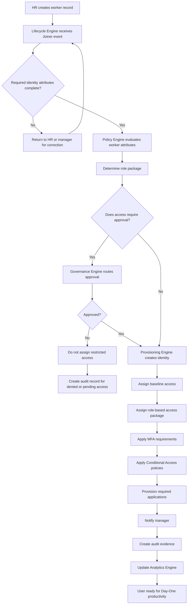

# IdentityOS Joiner Workflow

## Purpose

This diagram shows how IdentityOS processes a Joiner event.

A Joiner event occurs when a new employee, contractor, vendor, intern, or temporary worker enters the organization and requires identity creation, baseline access, role-based access, security controls, and audit evidence.

The goal of the Joiner workflow is to ensure that new identities are created securely, access is assigned based on business context, and users are productive on Day One.

---

## Joiner Workflow Diagram



---

## Joiner Workflow Inputs

A Joiner event should include the identity attributes required to make access decisions.

| Attribute         | Purpose                                                    |
| ----------------- | ---------------------------------------------------------- |
| First Name        | Used to create identity record.                            |
| Last Name         | Used to create identity record.                            |
| Employee ID       | Unique worker identifier.                                  |
| Worker Type       | Employee, contractor, vendor, intern, or temporary worker. |
| Department        | Used for access and role mapping.                          |
| Job Title         | Used for role package assignment.                          |
| Manager           | Used for approvals and notifications.                      |
| Location          | Used for regional access and Conditional Access context.   |
| Start Date        | Used for provisioning timing.                              |
| Employment Status | Determines whether identity should become active.          |
| Business Unit     | Supports access segmentation.                              |
| Role Package      | Defines baseline access.                                   |

---

## Joiner Workflow Outputs

A successful Joiner workflow should produce:

* Created identity
* Populated user attributes
* Assigned baseline access
* Assigned role-based access package
* Applied MFA requirement
* Applied Conditional Access policies
* Provisioned required applications
* Manager notification
* Audit evidence
* Updated analytics

---

## Joiner Access Decision

IdentityOS should determine access based on business context.

Example:

```text
Worker Type: Employee
Department: Legal
Job Title: Legal Associate
Location: Miami
Role Package: Legal Associate
```

Expected access outcome:

```text
Grant:
- Microsoft 365
- Teams
- Legal SharePoint Workspace
- Legal Document Management System
- Case Collaboration Workspace

Require:
- MFA
- Conditional Access
- Compliant Device

Review:
- Quarterly access review
```

---

## Joiner Governance Controls

The Joiner workflow should enforce governance controls such as:

* Required identity attributes
* Manager assignment
* Role package validation
* Approval for sensitive access
* Expiration for contractors and vendors
* Audit evidence generation
* Access owner assignment
* Review frequency assignment

Governance must begin when access is first granted.

---

## Joiner Audit Evidence

Every Joiner event should generate audit evidence.

Audit evidence should include:

* Event ID
* Event source
* Identity created
* Role package assigned
* Access granted
* Access denied or pending
* Approval result
* Manager notified
* Security controls applied
* Timestamp
* Workflow status

This evidence helps prove that the user was provisioned according to policy.

---

## Joiner Success Criteria

The Joiner workflow is successful when:

* Required identity attributes are complete.
* The correct role package is assigned.
* Required applications are provisioned.
* MFA and Conditional Access are applied.
* Sensitive access is approved before assignment.
* Manager is notified.
* Audit evidence is created.
* User is ready on Day One.
* Access aligns with business role and least privilege.

---

## Summary

The Joiner workflow turns a new worker record into a secure, governed, and productive identity.

IdentityOS ensures that onboarding is not simply account creation. It is a controlled identity lifecycle event that connects business context, access policy, provisioning, governance, and auditability.

> A successful Joiner workflow gives users the access they need without creating unnecessary risk.
