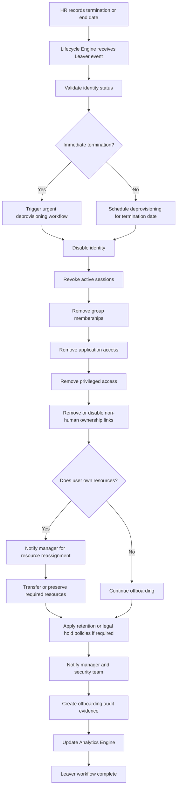

# IdentityOS Leaver Workflow

## Purpose

This diagram shows how IdentityOS processes a Leaver event.

A Leaver event occurs when an employee, contractor, vendor, intern, temporary worker, or other identity exits the organization or no longer requires access.

The Leaver workflow is one of the most critical identity security controls because delayed or incomplete access removal can create serious risk.

IdentityOS treats offboarding as a security, governance, audit, and operational continuity event.

---

## Leaver Workflow Diagram



---

## Leaver Workflow Inputs

A Leaver event should include the information required to remove access properly.

| Attribute                   | Purpose                                                                                     |
| --------------------------- | ------------------------------------------------------------------------------------------- |
| Employee ID                 | Identifies the user.                                                                        |
| User Principal Name         | Identifies the account.                                                                     |
| Worker Type                 | Employee, contractor, vendor, intern, or temporary worker.                                  |
| Department                  | Helps identify business ownership.                                                          |
| Manager                     | Receives notification and resource ownership tasks.                                         |
| Termination Date            | Determines when access should be removed.                                                   |
| Termination Type            | Scheduled, immediate, voluntary, involuntary, contractor expiration, or vendor termination. |
| Privileged Access Indicator | Determines whether elevated access must be removed.                                         |
| Application Access          | Used to remove downstream app access.                                                       |
| Resource Ownership          | Identifies files, groups, apps, or service accounts owned by the user.                      |

---

## Leaver Workflow Outputs

A successful Leaver workflow should produce:

* Disabled identity
* Revoked active sessions
* Removed group memberships
* Removed application access
* Removed privileged access
* Removed or transferred resource ownership
* Manager notification
* Security notification when required
* Audit evidence
* Updated analytics
* Reduced identity risk

---

## Leaver Access Removal Model

The Leaver workflow should remove access across multiple layers.

```text id="xyyqj6"
Identity Provider
Directory Groups
Cloud Applications
SaaS Applications
Privileged Roles
Collaboration Resources
Owned Service Accounts
Shared Mailboxes
Security Exceptions
```

Offboarding should not stop at disabling one account.

A mature offboarding process should ensure access is removed across the full identity ecosystem.

---

## Immediate Termination Scenario

Immediate terminations require urgent action.

The workflow should prioritize:

* Disable account immediately
* Revoke sessions
* Remove privileged access
* Remove sensitive application access
* Notify security team
* Preserve audit evidence
* Apply legal hold or retention requirements if needed

### Immediate Termination Example

```text id="vxg4kf"
Termination Type: Immediate
Worker Type: Employee
Privileged Access: Yes

Required Actions:
- Disable account
- Revoke sessions
- Remove privileged roles
- Notify Security
- Preserve evidence
```

Immediate termination workflows should be fast, secure, and auditable.

---

## Scheduled Termination Scenario

Scheduled terminations can be prepared in advance.

The workflow should:

* Validate termination date
* Schedule access removal
* Notify manager
* Identify resource ownership
* Prepare mailbox or file handling if required
* Remove access on termination date
* Create audit evidence

### Scheduled Termination Example

```text id="znx3ke"
Termination Type: Scheduled
Termination Date: 2026-06-30
Privileged Access: No

Required Actions:
- Schedule disablement
- Remove access on termination date
- Notify manager
- Preserve records
```

---

## Contractor Expiration Scenario

Contractor access should expire automatically unless renewed.

The workflow should:

* Detect contractor end date
* Notify sponsor before expiration
* Require renewal approval
* Disable access if not renewed
* Remove application access
* Generate audit evidence

### Contractor Expiration Example

```text id="ol4g9t"
Worker Type: Contractor
End Date: 2026-08-31
Sponsor: Taylor Brooks

Required Actions:
- Notify sponsor
- Request renewal decision
- Auto-disable if not renewed
- Remove project access
```

Contractor access should never remain active without a current business sponsor.

---

## Vendor Offboarding Scenario

Vendor offboarding requires sponsor and system owner involvement.

The workflow should:

* Confirm vendor relationship status
* Notify business sponsor
* Remove vendor portal access
* Remove collaboration access
* Remove external sharing permissions
* Preserve required records
* Create audit evidence

Vendor identities should not remain active after the business relationship ends.

---

## Privileged Access Removal

Leaver workflows must remove privileged access quickly and completely.

Privileged access may include:

* Global administrator roles
* User administrator roles
* Security administrator roles
* Application administrator roles
* Directory administrator roles
* Cloud administrator roles
* Privileged application roles
* PAM/PIM eligibility
* Break-glass-related ownership
* Admin group memberships

### Privileged Removal Questions

The Leaver workflow should ask:

* Does this user have privileged access?
* Is any privileged role permanently assigned?
* Is any privileged role eligible?
* Does the user own applications or service accounts?
* Does the user own security groups?
* Does the user own automation accounts?
* Does security need to be notified?

Privileged access removal should be validated and logged.

---

## Resource Ownership Handling

Some leavers may own resources that must be transferred or preserved.

Examples:

* Shared mailboxes
* Teams
* SharePoint sites
* Security groups
* Distribution lists
* Application registrations
* Service accounts
* Automation scripts
* Documents
* Dashboards
* Project workspaces

IdentityOS should notify the manager or resource owner before removing access where business continuity is required.

---

## Retention and Legal Hold

Some departures may require retention, legal hold, or investigation support.

IdentityOS should support workflows for:

* Legal hold
* Mailbox retention
* File preservation
* Audit log preservation
* Investigation evidence
* Data ownership transfer
* Compliance retention requirements

Leaver workflows should remove access while preserving required records.

---

## Leaver Audit Evidence

Every Leaver event should generate audit evidence.

Audit evidence should include:

* Event ID
* Identity disabled
* Time disabled
* Sessions revoked
* Groups removed
* Applications deprovisioned
* Privileged roles removed
* Manager notified
* Security notified
* Resource ownership transferred
* Retention actions applied
* Workflow completion status
* Exceptions or failures

This evidence helps prove that the user was offboarded according to policy.

---

## Leaver Metrics

The Leaver workflow should generate metrics such as:

* Average offboarding completion time
* Number of leavers processed
* Number of immediate terminations
* Number of scheduled terminations
* Number of failed deprovisioning actions
* Number of privileged roles removed
* Number of sessions revoked
* Number of applications deprovisioned
* Number of resource transfers required
* Number of contractor expirations completed
* Leaver workflows with unresolved actions

These metrics help identity leaders measure offboarding reliability and risk reduction.

---

## Leaver Success Criteria

The Leaver workflow is successful when:

* The identity is disabled on time.
* Active sessions are revoked.
* Group memberships are removed.
* Application access is removed.
* Privileged access is removed.
* Contractor and vendor access expires correctly.
* Resource ownership is transferred where required.
* Retention requirements are applied.
* Manager and security notifications are sent.
* Audit evidence is generated.
* No unnecessary access remains active.

---

## Summary

The Leaver workflow ensures that identities exit the organization securely, completely, and with evidence.

IdentityOS treats offboarding as more than disabling an account. It is a coordinated process that removes access, protects data, preserves business continuity, and creates audit proof.

> A strong Leaver workflow protects the organization after the relationship ends.
