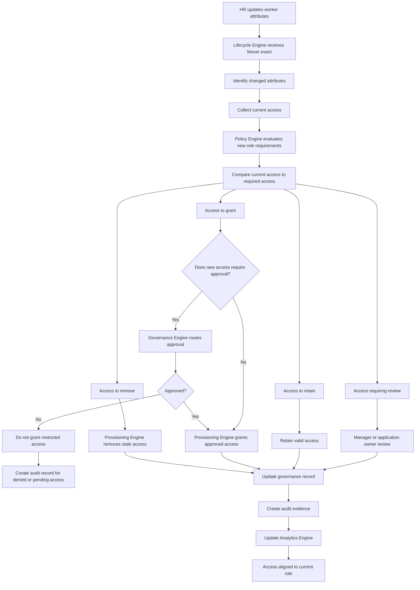

# IdentityOS Mover Workflow

## Purpose

This diagram shows how IdentityOS processes a Mover event.

A Mover event occurs when an existing identity changes role, department, manager, location, business unit, responsibility, or access requirements.

Mover events are one of the most important identity governance scenarios because they are a major source of privilege creep.

When users move across the organization, they often receive new access but retain old access. Over time, this creates excessive permissions, stale entitlements, audit issues, and security risk.

The Mover workflow ensures that access changes when business context changes.

---

## Mover Workflow Diagram



---

## Mover Workflow Inputs

A Mover event should include both previous and new identity context.

| Attribute           | Purpose                                           |
| ------------------- | ------------------------------------------------- |
| Employee ID         | Identifies the user.                              |
| Previous Department | Determines access that may need removal.          |
| New Department      | Determines new access requirements.               |
| Previous Job Title  | Helps identify prior role package.                |
| New Job Title       | Helps identify new role package.                  |
| Previous Manager    | Useful for audit and historical ownership.        |
| New Manager         | Used for future approvals and reviews.            |
| Location            | May affect Conditional Access or regional access. |
| Effective Date      | Determines when access changes should occur.      |
| Current Access      | Used for access comparison.                       |
| New Role Package    | Defines target access state.                      |

---

## Mover Workflow Outputs

A successful Mover workflow should produce:

* New role access assigned
* Old role access removed
* Valid access retained
* Sensitive access reviewed
* Privileged access reviewed
* Exceptions documented
* Manager notified
* Application owners notified if required
* Audit evidence generated
* Analytics updated

---

## Access Comparison Model

The Mover workflow is based on comparing current access against required access.

```text
Current Access
      ↓
Required Access for New Role
      ↓
Comparison
      ↓
Retain / Remove / Grant / Review
```

### Access Categories

| Category  | Meaning                                                            |
| --------- | ------------------------------------------------------------------ |
| Retain    | Access still matches the new role.                                 |
| Remove    | Access belonged to the previous role and is no longer needed.      |
| Grant     | Access is required for the new role.                               |
| Review    | Access may be sensitive, privileged, or unclear.                   |
| Exception | Access is outside the role model but has a business justification. |

---

## Mover Example

A user moves from Finance to Legal Operations.

### Previous Role

```text
Department: Finance
Job Title: Finance Analyst
Access:
- Microsoft 365
- Teams
- Finance SharePoint
- Financial Reporting Portal
```

### New Role

```text
Department: Legal
Job Title: Legal Operations Analyst
Required Access:
- Microsoft 365
- Teams
- Legal Operations Workspace
- Legal Document Management System
```

### Policy Decision

```text
Retain:
- Microsoft 365
- Teams

Remove:
- Finance SharePoint
- Financial Reporting Portal

Grant:
- Legal Operations Workspace
- Legal Document Management System

Review:
- Any retained finance-related access
```

This prevents the user from carrying unnecessary Finance access into the Legal department.

---

## Mover Governance Controls

Mover events should trigger governance controls such as:

* Access comparison
* Role package reassessment
* Old access removal
* Sensitive access review
* Privileged access review
* Exception review
* Manager notification
* Application owner review when required
* Audit evidence creation

Mover events should not only add new access. They should clean up access that no longer matches the user’s current role.

---

## Privileged Access During Mover Events

Mover events should always evaluate privileged access.

The workflow should ask:

* Does the user currently have privileged access?
* Does the new role still require privileged access?
* Should privileged access be removed?
* Should privileged access become eligible instead of permanent?
* Does privileged access require new approval?
* Should security leadership review the change?

Privileged access should never move with a user automatically unless policy explicitly allows it.

---

## Exception Handling

Some access may need to remain temporarily after a role change.

Example:

```text
A user moves from Finance to Legal Operations but needs temporary access to Finance Reporting for a transition project.
```

This should be treated as an exception.

The exception should include:

* Business justification
* Approver
* Access owner
* Expiration date
* Review date
* Risk level
* Audit record

Temporary access should not become permanent access.

---

## Mover Audit Evidence

Every Mover event should generate evidence.

Audit evidence should include:

* Event ID
* Previous department
* New department
* Previous job title
* New job title
* Current access before change
* Access removed
* Access granted
* Access retained
* Access reviewed
* Exceptions created
* Approval decisions
* Timestamp
* Workflow completion status

This evidence helps prove that access was adjusted based on the user’s new role.

---

## Mover Metrics

The Mover workflow should generate metrics such as:

* Number of Mover events processed
* Access removed during Mover events
* Access granted during Mover events
* Privileged access removed
* Exceptions created
* Reviews triggered
* Average time to complete Mover workflow
* Mover events with unresolved access
* Departments with frequent access drift

Mover metrics help identity teams measure privilege creep reduction.

---

## Mover Success Criteria

The Mover workflow is successful when:

* New role access is assigned accurately.
* Old role access is removed.
* Privileged access is reviewed.
* Sensitive access is reviewed.
* Exceptions are documented and time-bound.
* Audit evidence is generated.
* Manager and application owner reviews occur when required.
* Access reflects the user’s current business role.
* Privilege creep is reduced.

---

## Summary

The Mover workflow is one of the strongest controls in IdentityOS.

It ensures that users do not accumulate access simply because they changed jobs, departments, or responsibilities.

IdentityOS treats role changes as security events, governance events, and business alignment events.

> Mover events are where IdentityOS prevents yesterday’s access from becoming tomorrow’s risk.
