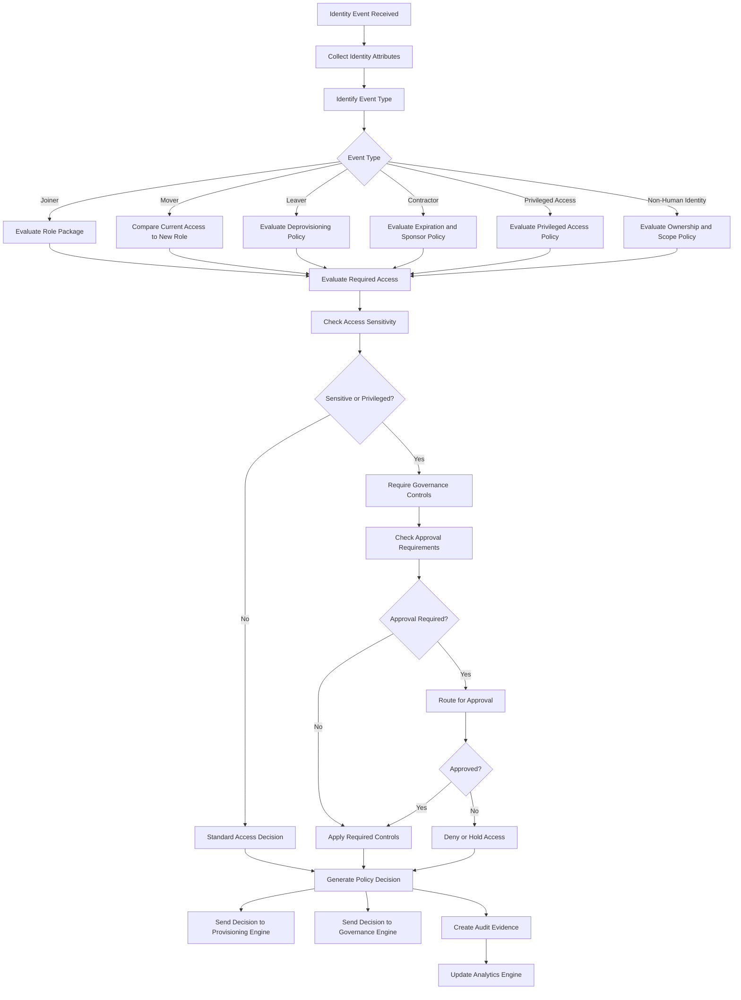

# IdentityOS Policy Engine Decision Flow

## Purpose

This diagram shows how the IdentityOS Policy Engine evaluates identity events and produces access decisions.

The Policy Engine is the decision-making layer of IdentityOS. It receives identity context, business attributes, role information, governance rules, and risk indicators, then determines what access should be granted, removed, retained, reviewed, denied, or escalated.

---

## Policy Engine Decision Flow



---

## Decision Inputs

The Policy Engine evaluates several categories of input.

| Input Category      | Examples                                                                 |
| ------------------- | ------------------------------------------------------------------------ |
| Identity Attributes | Department, job title, manager, location, worker type                    |
| Lifecycle Event     | Joiner, Mover, Leaver, contractor, privileged access request             |
| Role Model          | Role package, baseline access, sensitive access, privileged access       |
| Governance Rules    | Approval requirements, review frequency, expiration requirements         |
| Risk Context        | Sensitive application, external identity, privileged role, risky sign-in |
| Business Context    | Business unit, cost center, project assignment, application ownership    |

---

## Decision Outputs

The Policy Engine can produce multiple decision types.

| Decision | Meaning                                          |
| -------- | ------------------------------------------------ |
| Grant    | Access should be assigned.                       |
| Remove   | Access should be removed.                        |
| Retain   | Access should remain active.                     |
| Review   | Access requires review by manager or owner.      |
| Approve  | Access requires approval before assignment.      |
| Deny     | Access should not be granted.                    |
| Expire   | Access should be removed after a defined period. |
| Escalate | Access requires higher-level review.             |
| Flag     | Access should be marked as risky or exceptional. |

---

## Example Decision Path: Joiner

```text id="wqez1a"
Event Type: Joiner
Department: Legal
Job Title: Legal Associate
Worker Type: Employee

Policy Engine Decision:
- Grant Legal Associate role package
- Require MFA
- Apply Conditional Access
- Schedule quarterly access review
- Create audit evidence
```

---

## Example Decision Path: Mover

```text id="fvoqfb"
Event Type: Mover
Previous Department: Finance
New Department: Legal
Previous Role: Finance Analyst
New Role: Legal Operations Analyst

Policy Engine Decision:
- Remove Finance SharePoint access
- Remove Financial Reporting Portal access
- Grant Legal Operations Workspace
- Grant Legal Document Management System
- Trigger manager review
- Create audit evidence
```

---

## Example Decision Path: Privileged Access

```text id="p2ajkg"
Event Type: Privileged Access Request
Requested Role: Security Reader
Assignment Type: Eligible
Duration: 2 hours

Policy Engine Decision:
- Require MFA
- Require justification
- Require approval
- Limit access to 2 hours
- Log activation
- Schedule monthly privileged access review
```

---

## Policy Control Questions

The Policy Engine should ask:

1. What identity event occurred?
2. What changed?
3. What role package applies?
4. What access is required?
5. What access should be removed?
6. Is the access sensitive?
7. Is the access privileged?
8. Is approval required?
9. Is expiration required?
10. Is this an exception?
11. Does this create a separation of duties issue?
12. What audit evidence must be generated?

---

## Decision Record

Every policy decision should produce a decision record.

A decision record should include:

* Event ID
* Decision ID
* Identity
* Event type
* Policy evaluated
* Decision result
* Access granted
* Access removed
* Controls required
* Approval requirement
* Risk level
* Review frequency
* Audit reason
* Timestamp

Decision records make access explainable.

---

## Summary

The Policy Engine turns identity context into secure access outcomes.

It ensures that identity decisions are consistent, explainable, governed, and auditable.

> The Policy Engine is where business intent becomes access control.
