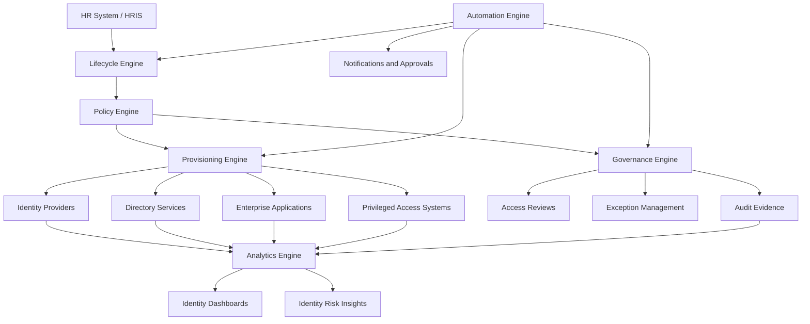

# IdentityOS Architecture

## Purpose

This document defines the high-level architecture for IdentityOS.

IdentityOS is designed as an enterprise identity orchestration and governance layer. It does not replace identity providers, HR systems, directories, ticketing platforms, or security tools. Instead, it coordinates identity activity across those systems through lifecycle events, policy evaluation, automation, governance, and analytics.

The purpose of this architecture is to show how identity can operate as a connected enterprise system rather than a collection of disconnected administrative processes.

---

## Architecture Summary

IdentityOS is organized around six core engines:

1. **Lifecycle Engine**
2. **Policy Engine**
3. **Provisioning Engine**
4. **Governance Engine**
5. **Automation Engine**
6. **Analytics Engine**

Together, these engines create a system that can:

* Detect identity lifecycle events.
* Evaluate access decisions.
* Provision and remove access.
* Govern exceptions and privileged access.
* Generate audit evidence.
* Provide visibility into identity risk.

---

## High-Level Architecture



---

## Core Architectural Concept

IdentityOS operates as an orchestration layer between business events and technical access outcomes.

A business event may include:

* A new employee joining.
* An employee changing roles.
* A contractor reaching an expiration date.
* A privileged role being requested.
* A vendor requiring temporary access.
* An employee leaving the organization.

IdentityOS receives or detects the event, evaluates policy, triggers the proper workflow, provisions or removes access, and records the result.

The architecture follows this core pattern:

```text
Business Event
      ↓
Lifecycle Engine
      ↓
Policy Engine
      ↓
Provisioning / Governance / Automation
      ↓
Audit Evidence
      ↓
Analytics and Reporting
```

---

## Core Engines

## 1. Lifecycle Engine

The Lifecycle Engine is responsible for understanding identity events.

It manages the major identity lifecycle states:

* Joiner
* Mover
* Leaver
* Contractor onboarding
* Contractor expiration
* Vendor access lifecycle
* Privileged access lifecycle
* Service account lifecycle

The Lifecycle Engine receives signals from systems such as HR platforms, ticketing systems, identity providers, and scheduled governance workflows.

### Responsibilities

* Detect lifecycle events.
* Classify the event type.
* Identify the affected identity.
* Determine whether the event requires provisioning, deprovisioning, review, or approval.
* Send the event to the Policy Engine.
* Maintain lifecycle state history.

---

## 2. Policy Engine

The Policy Engine determines what should happen based on business rules and identity attributes.

It evaluates attributes such as:

* Department
* Job title
* Manager
* Location
* Employment type
* Worker status
* Start date
* End date
* Risk classification
* Privileged eligibility
* Application ownership
* Compliance requirements

### Responsibilities

* Evaluate access rules.
* Map users to role packages.
* Identify required access.
* Identify access to remove.
* Detect policy violations.
* Determine approval requirements.
* Route exceptions to governance workflows.

The Policy Engine is the decision-making layer of IdentityOS.

---

## 3. Provisioning Engine

The Provisioning Engine performs technical identity actions across connected systems.

It may integrate with:

* Microsoft Entra ID
* Active Directory
* Microsoft 365
* Google Workspace
* Okta
* SaaS applications
* Cloud platforms
* Privileged access platforms
* Collaboration tools
* Line-of-business applications

### Responsibilities

* Create user accounts.
* Update identity attributes.
* Assign groups.
* Remove groups.
* Provision applications.
* Disable accounts.
* Revoke sessions.
* Remove privileged access.
* Deprovision applications.
* Record provisioning results.

The Provisioning Engine turns policy decisions into technical actions.

---

## 4. Governance Engine

The Governance Engine ensures access remains appropriate over time.

It manages governance processes such as:

* Access reviews
* Manager certifications
* Application owner reviews
* Privileged access reviews
* Contractor access reviews
* Exception reviews
* Segregation of duties checks
* Audit evidence collection

### Responsibilities

* Schedule access reviews.
* Track review completion.
* Route access decisions to managers or owners.
* Manage exceptions.
* Enforce expiration dates.
* Generate evidence for audits.
* Identify overdue reviews.
* Track governance metrics.

The Governance Engine ensures identity does not drift away from business need.

---

## 5. Automation Engine

The Automation Engine executes workflows across IdentityOS.

It is responsible for reducing repetitive manual work and connecting identity processes across systems.

### Responsibilities

* Trigger onboarding workflows.
* Trigger offboarding workflows.
* Send manager notifications.
* Send approval requests.
* Execute scheduled reviews.
* Enforce expiration dates.
* Run cleanup tasks.
* Call APIs.
* Execute scripts.
* Create audit records.

The Automation Engine ensures identity workflows happen consistently and on time.

---

## 6. Analytics Engine

The Analytics Engine provides visibility into identity health, governance, and risk.

It collects signals from identity systems, applications, governance workflows, and audit records.

### Responsibilities

* Track onboarding time.
* Track offboarding completion.
* Identify stale access.
* Identify dormant accounts.
* Monitor privileged assignments.
* Track access review completion.
* Detect policy exceptions.
* Report identity risk trends.
* Provide executive dashboards.

The Analytics Engine helps leaders understand whether identity is operating securely and efficiently.

---

## External Systems

IdentityOS is designed to integrate with external enterprise systems.

| System Type       | Example Systems                       | Role in Architecture                          |
| ----------------- | ------------------------------------- | --------------------------------------------- |
| HR System         | Workday, UKG, SAP SuccessFactors      | Source of employee lifecycle events           |
| Identity Provider | Microsoft Entra ID, Okta              | Authentication and identity management        |
| Directory Service | Active Directory, LDAP                | Legacy and hybrid identity support            |
| Collaboration     | Microsoft 365, Google Workspace       | Productivity access                           |
| Ticketing         | ServiceNow, Jira Service Management   | Requests, approvals, and operational tracking |
| PAM/PIM           | Microsoft PIM, CyberArk, BeyondTrust  | Privileged access governance                  |
| SIEM              | Microsoft Sentinel, Splunk            | Identity monitoring and alerting              |
| SaaS Apps         | Salesforce, legal apps, finance tools | Business application access                   |

---

## Reference Enterprise Model

IdentityOS uses a fictional organization called **Atlas Legal Group** as the reference enterprise.

Atlas Legal Group represents a large professional services organization with:

* 10,000+ users
* Multiple regions
* Hybrid identity
* Microsoft Entra ID
* Active Directory
* Microsoft 365
* Contractors and vendors
* Privileged administrators
* Strict compliance requirements
* Sensitive client and business data

This reference model allows the architecture to simulate realistic enterprise identity scenarios without relying on proprietary employer information.

---

## Identity Event Flow

A typical IdentityOS event follows this flow:

### Step 1: Event Detection

An identity-related event is detected.

Examples:

* HR creates a new employee.
* A user changes department.
* A contractor end date approaches.
* A manager requests additional access.
* A privileged role is requested.
* A termination record is received.

### Step 2: Event Classification

The Lifecycle Engine classifies the event.

Examples:

* Joiner
* Mover
* Leaver
* Access request
* Privileged access request
* Contractor expiration
* Governance review

### Step 3: Policy Evaluation

The Policy Engine evaluates the event against business rules.

It determines:

* Required access
* Access to remove
* Approval requirements
* Exceptions
* Risk level
* Review requirements
* Expiration requirements

### Step 4: Workflow Execution

The Automation Engine and Provisioning Engine perform the required actions.

Examples:

* Create account
* Assign groups
* Provision apps
* Remove old access
* Disable account
* Send approvals
* Notify manager
* Create audit record

### Step 5: Governance and Audit

The Governance Engine records the decision and ensures the access remains reviewable.

It tracks:

* Who received access
* Why it was granted
* Who approved it
* When it was granted
* When it expires
* When it should be reviewed

### Step 6: Analytics and Reporting

The Analytics Engine updates dashboards and identity metrics.

Examples:

* Onboarding completion time
* Pending access reviews
* Privileged access count
* Stale permissions
* Dormant accounts
* Policy exceptions
* Offboarding completion rate

---

## Security Architecture

IdentityOS supports Zero Trust principles by enforcing identity-centered controls.

Security controls include:

* MFA enforcement
* Conditional Access policies
* Least privilege access
* Privileged access eligibility
* Just-in-time access
* Session revocation
* Access expiration
* Risk-based review triggers
* Non-human identity ownership
* Continuous access review

IdentityOS assumes that access should be continuously verified, limited, monitored, and governed.

---

## Governance Architecture

IdentityOS governance is built into the identity lifecycle.

Governance events should occur when:

* Access is granted.
* Access changes.
* Access becomes privileged.
* Access is no longer aligned with a role.
* A contractor approaches expiration.
* A review cycle begins.
* A policy exception is created.
* A user leaves the organization.

Governance is not a separate activity from identity. Governance is part of identity.

---

## Scalability Considerations

IdentityOS is designed to scale across:

* Departments
* Offices
* Regions
* Applications
* Business units
* Contractors
* Vendors
* Privileged roles
* Cloud platforms
* Hybrid environments

To support scale, the architecture favors:

* Attribute-driven access decisions
* Reusable role packages
* Policy-based automation
* Standard workflows
* Centralized audit evidence
* Modular integrations
* Clear ownership models

---

## Architecture Outcomes

A successful IdentityOS architecture should help the enterprise achieve:

* Faster onboarding
* Cleaner role changes
* Faster offboarding
* Reduced privilege creep
* Reduced stale access
* Better access review completion
* Stronger privileged access governance
* Improved audit readiness
* Reduced manual IAM workload
* Increased identity visibility
* Better alignment between security and business operations

---

## Summary

IdentityOS is designed as a connected identity orchestration and governance architecture.

It brings together lifecycle management, policy evaluation, provisioning, governance, automation, and analytics into one operating model.

The result is an identity system that is more secure, more scalable, more auditable, and more aligned with how the business actually works.

> IdentityOS turns identity from a set of administrative tasks into an enterprise operating system for trust.
