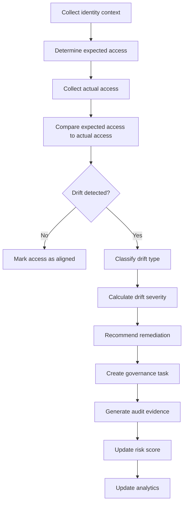

# IdentityOS Access Drift Model

## Purpose

The IdentityOS Access Drift Model defines how IdentityOS identifies access that no longer aligns with an identity’s expected role, lifecycle state, business purpose, or governance requirements.

Access drift occurs when actual access differs from intended access.

The purpose of this model is to help IdentityOS detect stale access, excessive access, orphaned access, privilege creep, expired access, and access that no longer matches the identity’s current business context.

---

## Core Concept

IdentityOS compares two access states:

```text id="3c1z05"
Expected Access
      vs.
Actual Access
```

If actual access is greater than, different from, or no longer aligned with expected access, IdentityOS identifies drift.

```text id="kv263b"
Access Drift = Actual Access - Expected Access
```

Access drift is one of the main causes of privilege creep.

---

## Why Access Drift Matters

Access drift creates risk because users, contractors, vendors, and non-human identities may retain access they no longer need.

Common causes include:

* Users changing roles
* Users changing departments
* Manual group assignments
* Temporary access that never expired
* Exceptions that became permanent
* Contractors not being removed on time
* Vendors retaining access after a project ends
* Privileged roles not being reviewed
* Service accounts missing owners
* Applications not connected to centralized provisioning
* Access reviews that do not trigger remediation

Access drift is dangerous because it often grows quietly over time.

---

## Drift Types

| Drift Type               | Description                                                                    |
| ------------------------ | ------------------------------------------------------------------------------ |
| Role Drift               | Access no longer matches the user’s current job role.                          |
| Department Drift         | Access belongs to a previous department.                                       |
| Privilege Drift          | Privileged access remains after it is no longer required.                      |
| Contractor Drift         | Contractor access remains after expiration or project completion.              |
| Vendor Drift             | Vendor access remains after the business relationship ends.                    |
| Exception Drift          | Exception-based access remains active without current justification.           |
| Application Drift        | Application permissions are broader than expected.                             |
| Group Drift              | Group memberships do not match the intended role package.                      |
| Non-Human Identity Drift | Service accounts or automation identities lack owner, purpose, or valid scope. |
| Leaver Drift             | Former workers retain active access.                                           |

---

## Access States

IdentityOS should evaluate access across multiple states.

| State           | Meaning                                                                                                    |
| --------------- | ---------------------------------------------------------------------------------------------------------- |
| Expected Access | Access the identity should have based on current role, department, worker type, and business need.         |
| Actual Access   | Access the identity currently has across identity providers, groups, applications, and privileged systems. |
| Excess Access   | Access the identity has but should not have.                                                               |
| Missing Access  | Access the identity should have but does not currently have.                                               |
| Valid Access    | Access that matches the expected access model.                                                             |
| Unknown Access  | Access that cannot be mapped to a known role, owner, or business purpose.                                  |

---

## Drift Detection Inputs

IdentityOS can use the following inputs to detect access drift:

* Current role
* Current department
* Current manager
* Current worker type
* Current access
* Expected role package
* Historical role package
* Application assignments
* Group memberships
* Privileged role assignments
* Contractor expiration date
* Vendor sponsorship status
* Exception records
* Access review results
* Application owner feedback
* Audit evidence
* Last reviewed date
* Last used date

---

## Drift Detection Workflow



---

## Drift Severity

Access drift should be assigned a severity level.

| Severity | Meaning                                                                       |
| -------- | ----------------------------------------------------------------------------- |
| Low      | Minor access mismatch with limited risk.                                      |
| Medium   | Access mismatch requires review but is not immediately critical.              |
| High     | Sensitive access, department mismatch, or role mismatch requires remediation. |
| Critical | Privileged, expired, leaver, or unmanaged access requires urgent action.      |

---

## Drift Scoring Factors

| Drift Factor                              | Severity Impact |
| ----------------------------------------- | --------------- |
| Access from previous department           | Medium          |
| Sensitive application access outside role | High            |
| Privileged access outside role            | Critical        |
| Contractor access after expiration        | Critical        |
| Vendor access without sponsor             | High            |
| Exception without expiration              | High            |
| Service account without owner             | High            |
| Leaver with active access                 | Critical        |
| Access review removal not remediated      | High            |
| Unknown application owner                 | Medium          |
| Access unused for long period             | Medium          |
| Group membership outside role package     | Medium          |

---

## Example Scenario: Mover Drift

A user moves from Finance to Legal Operations.

### Expected Access

```text id="4sa35l"
Legal Operations Workspace
Legal Document Management System
Microsoft 365
Teams
```

### Actual Access

```text id="vh9cv1"
Legal Operations Workspace
Legal Document Management System
Microsoft 365
Teams
Finance SharePoint
Financial Reporting Portal
```

### Drift Detected

```text id="sprydn"
Finance SharePoint
Financial Reporting Portal
```

### Drift Classification

```text id="458zqb"
Drift Type: Department Drift
Severity: High
Recommended Action: Remove Finance access and create audit evidence.
```

---

## Example Scenario: Contractor Drift

A contractor’s project ended, but access remains active.

```text id="dwnfdn"
Worker Type: Contractor
End Date: 2026-08-31
Current Date: After expiration
Access Still Active: Yes
```

### Drift Classification

```text id="yg9v46"
Drift Type: Contractor Drift
Severity: Critical
Recommended Action: Disable contractor access unless sponsor renewal is approved.
```

---

## Example Scenario: Privileged Drift

A user has a privileged role that is no longer required by their current job.

```text id="827p7s"
Current Role: Security Analyst
Privileged Assignment: Eligible User Administrator
Business Justification: Missing
Last Reviewed: Overdue
```

### Drift Classification

```text id="ufgduf"
Drift Type: Privilege Drift
Severity: Critical
Recommended Action: Remove privileged eligibility or route for privileged access review.
```

---

## Remediation Actions

IdentityOS should recommend remediation based on drift type and severity.

| Drift Condition          | Recommended Action                                |
| ------------------------ | ------------------------------------------------- |
| Role drift               | Remove access outside current role package.       |
| Department drift         | Remove previous department access.                |
| Privilege drift          | Remove or review privileged access.               |
| Contractor drift         | Disable access or require sponsor renewal.        |
| Vendor drift             | Remove access or validate sponsor.                |
| Exception drift          | Expire or renew exception with justification.     |
| Non-human identity drift | Validate owner, purpose, and scope.               |
| Leaver drift             | Disable identity and revoke sessions immediately. |

---

## Drift Detection Output

A drift detection record should include:

* Identity
* Event ID
* Drift type
* Drift severity
* Expected access
* Actual access
* Excess access
* Missing access
* Recommended remediation
* Governance owner
* Risk impact
* Audit reason
* Timestamp

Example:

```json id="beycsj"
{
  "identity": "morgan.lee@atlaslegal.example",
  "event_id": "EVT-MOVER-0001",
  "drift_type": "Department Drift",
  "drift_severity": "High",
  "expected_access": [
    "Legal Operations Workspace",
    "Legal Document Management System"
  ],
  "actual_access": [
    "Legal Operations Workspace",
    "Legal Document Management System",
    "Finance SharePoint",
    "Financial Reporting Portal"
  ],
  "excess_access": [
    "Finance SharePoint",
    "Financial Reporting Portal"
  ],
  "recommended_remediation": "Remove access from previous Finance role.",
  "audit_reason": "Mover event created access drift from previous department."
}
```

---

## Relationship to Risk Scoring

Access drift should influence identity risk scoring.

```text id="fbw5i2"
Access Drift Detected
        ↓
Risk Score Increases
        ↓
Governance Review Triggered
        ↓
Remediation Recommended
        ↓
Audit Evidence Created
```

Access drift is one of the strongest signals that access may no longer be justified.

---

## Drift Metrics

IdentityOS should track drift metrics such as:

* Identities with drift
* Access items requiring removal
* Drift by department
* Drift by application
* Drift by worker type
* Privileged drift count
* Contractor drift count
* Vendor drift count
* Non-human identity drift count
* Average time to remediate drift
* Drift remediation completion rate
* Drift trends over time

---

## Success Criteria

The Access Drift Model is successful when:

* Access outside the expected role is visible.
* Previous department access is removed.
* Contractor and vendor access does not persist without approval.
* Privileged access drift is escalated.
* Exceptions do not become permanent.
* Non-human identities remain owned and scoped.
* Remediation actions are tracked.
* Audit evidence is generated.
* Risk scoring reflects access drift.
* Identity teams can measure and reduce privilege creep.

---

## Summary

The IdentityOS Access Drift Model helps detect when actual access no longer matches expected access.

It turns privilege creep into something visible, measurable, and remediable.

> Access drift is how yesterday’s permissions become tomorrow’s risk.
